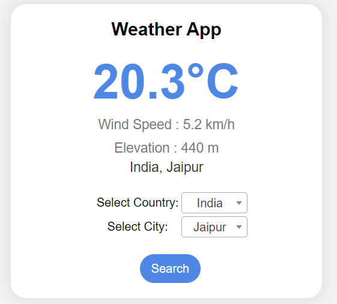

# Weather App

## Overview
This is a simple and interactive weather application that displays the following information:
- **Current Temperature**
- **Elevation**
- **Wind Speed**

Users can select a **country** and then a **city** to retrieve live weather data.

The app is built using:
- **Flask** (backend server)
- **AJAX** (asynchronous requests)
- **Two Weather APIs** for data retrieval:
  1. [OpenWeatherMap Geocoding API](https://api.openweathermap.org/geo/1.0/direct)
  2. [Open-Meteo API](https://api.open-meteo.com/v1/forecast)

## Features
- Select a **country** and then a **city** to fetch weather details.
- Display:
  - Current **Temperature**.
  - **Elevation** (altitude data).
  - **Wind Speed**.
- Seamless user experience using AJAX for dynamic updates.

## Tech Stack
- **Frontend**: HTML, CSS, JavaScript (AJAX)
- **Backend**: Flask (Python)
- **APIs**:
  - OpenWeatherMap for geocoding (latitude/longitude lookup based on city name).
  - Open-Meteo for weather details (temperature, wind speed, etc.).

## Project Structure
```
project-root/
|
|-- static/
|   |-- country-cities.json # JSON file for populating country and city dropdowns
|
|-- templates/
|   |-- index.html          # HTML file for the app layout
|
|-- app.py                  # Flask backend server
|-- requirements.txt        # Dependencies
|-- README.md               # Project documentation
```

## Installation
Follow these steps to run the weather app locally:

### Prerequisites
Ensure you have the following installed:
- **Python 3.x**
- **pip** (Python package installer)

### Steps
1. Clone the repository:
   ```bash
   git clone https://github.com/ajiteveryone8/weather-app-flask
   cd weather-app
   ```

2. Install the required dependencies:
   ```bash
   pip install -r requirements.txt
   ```

3. Get API keys:
   - Register at [OpenWeatherMap](https://openweathermap.org/) to get an API key.

4. Update `weather.py` with your API key:
   
5. Run the Flask server:
   ```bash
   python app.py
   ```

6. Open your browser and go to `http://127.0.0.1:5000`.

## Usage
1. Start the application.
2. Select a **country** from the dropdown list.
3. Select a **city**.
4. View:
   - Temperature
   - Wind Speed
   - Elevation

## APIs Used
### 1. OpenWeatherMap Geocoding API
This API retrieves the latitude and longitude of the selected city.
- Endpoint: `https://api.openweathermap.org/geo/1.0/direct`

Example request:
```bash
GET /geo/1.0/direct?q=London&limit=1&appid=YOUR_API_KEY
```

### 2. Open-Meteo API
This API fetches weather data such as temperature and wind speed.
- Endpoint: `https://api.open-meteo.com/v1/forecast`

Example request:
```bash
GET /v1/forecast?latitude=51.5074&longitude=-0.1278&current_weather=true
```

## Screenshots


## Future Improvements
- Add support for additional weather metrics (e.g., humidity, precipitation).
- Include historical weather data.
- Implement a search feature for easier city selection.

## Contributing
Feel free to submit issues, feature requests, or pull requests.

## License
This project is licensed under the MIT License.

---
**Author:** Ajit Choudhary
**Contact:** ajiteveryone8@gmail.com
